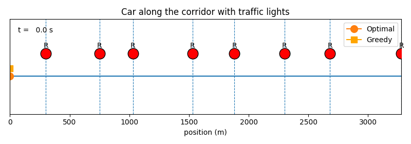

# Traffic GLosa Algorithm

This project implements a GLosa (Graph-based Localized Spatial-Temporal) algorithm for traffic prediction. The GLosa algorithm leverages historical traffic data to predict future traffic conditions, providing valuable insights for traffic management and planning.

## Project Structure

```
traffic-glosa
├── src
│   ├── main.py        
│   ├── viz.py          
│   └── utils.py        
├── requirements.txt     
└── README.md           
```

## Installation

To set up the environment, you need to have Python installed on your machine. It is recommended to create a virtual environment for this project. You can do this using the following commands:

```bash
# Create a virtual environment
python -m venv venv

# Activate the virtual environment
# On Windows
venv\Scripts\activate

# On Ubuntu (fish)
source venv/bin/activate.fish
```

Once the virtual environment is activated, install the required dependencies:

```bash
pip install -r requirements.txt
```

## Usage

After setting up the environment, you can run the GLosa algorithm and visualize the results. Here are some example commands:

1. **Run the GLosa Algorithm**:
   ```bash
   python src/main.py
   ```

## Traffic Animations

### Car Animation



### Speed Profile

